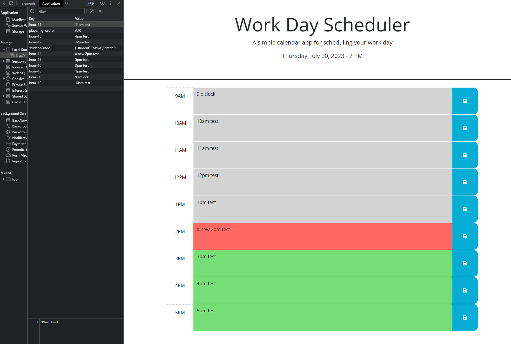

# Challenge 05 - Work Day Scheduler

## Description

Users can use this web application to save an hourly based itinerary of their workday, at least based on the typical American workday schedule of 9am to 5pm, that can be saved and recalled when revisiting the page. The user can have the application as a reminder of import task to do based on the current time so they can stay productive.

## Installation

There is no Installation involved on the users side to utilize this webpage; just visit [https://hello-andyjoe.github.io/Challenge-5/](https://hello-andyjoe.github.io/Challenge-5/)

## Usage

This web application is used by going to the webpage and clicking on the text box denoted by the hour for which you wish to create an entry. Write the entry and then click the blue save button to the right of the text box. The user can follow that procedure for each hour they wish to have their entry saved for, making sure to click the save button corresponding with the text box they had input in the text.  Whenever the page is reloaded, it will repopulate the text box with the corresponding data saved in Local Storage. Additionally, the text entry boxes will be colored differently depending on the time of day with hours past being gray, the current hour being red, and the upcoming hours being green. The current time and date are displayed on the top of the page under the header.

## Credits

The original HTML file, CSS file, and Javascript file provide the by the ASU Bootcamp course program.

Uses the Day.js jquery library and the documentation was used. - [https://day.js.org/](https://day.js.org/)

The 5th Module - Third-Party APIs of the ASU Bootcamp course program was used as reference in the creation of this application's script. Particularly in regards to DOM Traversal and Click Events.

Previously assignment of the Javascript Quiz was also used as reference in regards to implementing Local Storage.

[https://api.jquery.com/child-selector/](https://api.jquery.com/child-selector/) - Used in determining how to select the direct child of the parent element being selected by the 'this' selector in the 'var userText' with jquery.com being used in general to further my understanding. 

## License

MIT License

Copyright (c) 2023 Hello-AndyJoe

Permission is hereby granted, free of charge, to any person obtaining a copy
of this software and associated documentation files (the "Software"), to deal
in the Software without restriction, including without limitation the rights
to use, copy, modify, merge, publish, distribute, sublicense, and/or sell
copies of the Software, and to permit persons to whom the Software is
furnished to do so, subject to the following conditions:

The above copyright notice and this permission notice shall be included in all
copies or substantial portions of the Software.

THE SOFTWARE IS PROVIDED "AS IS", WITHOUT WARRANTY OF ANY KIND, EXPRESS OR
IMPLIED, INCLUDING BUT NOT LIMITED TO THE WARRANTIES OF MERCHANTABILITY,
FITNESS FOR A PARTICULAR PURPOSE AND NONINFRINGEMENT. IN NO EVENT SHALL THE
AUTHORS OR COPYRIGHT HOLDERS BE LIABLE FOR ANY CLAIM, DAMAGES OR OTHER
LIABILITY, WHETHER IN AN ACTION OF CONTRACT, TORT OR OTHERWISE, ARISING FROM,
OUT OF OR IN CONNECTION WITH THE SOFTWARE OR THE USE OR OTHER DEALINGS IN THE
SOFTWARE.
